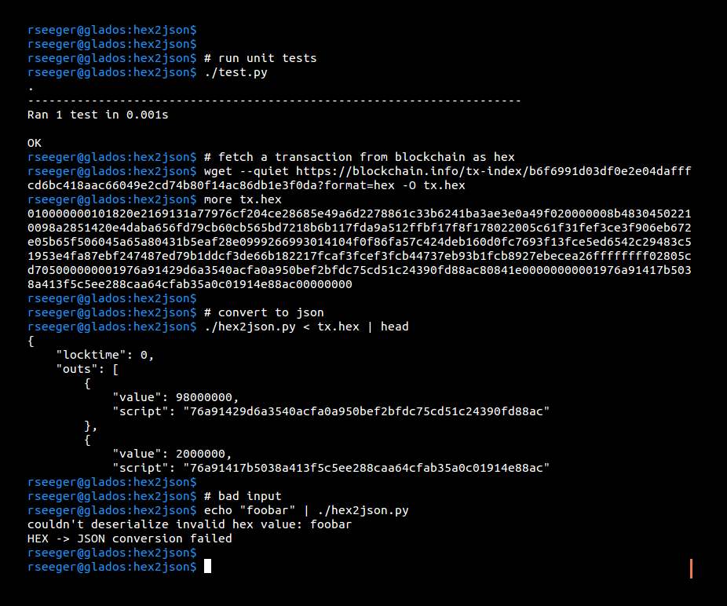

# hex2json

Command line tool to converting a bitcoin transaction from hex to JSON format. The hex string is read from STDIN and the JSON string is written to STDOUT.

## dependencies

None. transactions.py has a deserialize function built in, taken from:

https://raw.githubusercontent.com/vbuterin/pybitcointools/master/bitcoin/transaction.py

## sample usage

